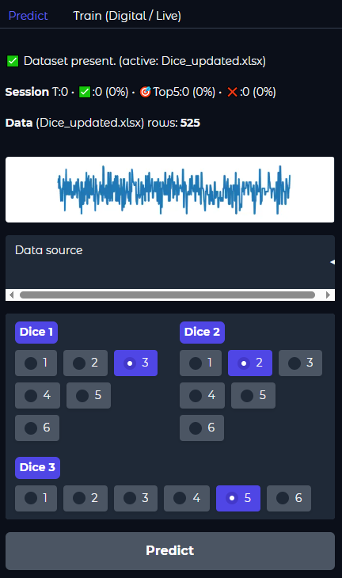

<h1 align="center">🎲 Dice Prediction ML</h1>

<p align="center">
  Predict the next outcome of a 3-dice game using Machine Learning trained on historical rolls.
</p>

<p align="center">
  <a href="https://github.com/aniktanims/Dice_Prediction/stargazers"></a>
  <a href="https://github.com/aniktanims/Dice_Prediction/network/members"></a>
  <a href="https://huggingface.co/spaces/aniktanims/Dice_Prediction_MTA"></a>
  <a href="https://github.com/aniktanims/Dice_Prediction/blob/main/LICENSE"></a>
</p>

---

## 🌐 Live Demo
Try it instantly on Hugging Face Spaces:  
[**Launch Dice Prediction App**](https://huggingface.co/spaces/aniktanims/Dice_Prediction_MTA)

<p align="center">
  
  <br>
  <i>Interactive UI: input historical rolls and get predicted next roll.</i>
</p>

---

## ✨ Features

- Predicts the next **3-dice roll outcome** using historical data  
- Supports **multiple ML models** (Random Forest, Ensemble)  
- **Bias detection & fairness metrics** included  
- **Large dataset** support for improved accuracy  
- **Deployable** via Hugging Face Spaces or local Python script  

---

## ⚡ Quick Start

### 1️⃣ Clone the Repo
```bash
git clone https://github.com/aniktanims/Dice_Prediction.git
cd Dice_Prediction
2️⃣ Install Dependencies
pip install -r requirements.txt
3️⃣ Run the App
python app.py
Opens a Gradio interface in your browser for interactive predictions.
```
📊 Dataset Format
dice1	dice2	dice3	total
3	2	6	11

dice1, dice2, dice3: individual dice rolls (1–6)

total: optional; auto-corrected if mismatched

🧠 Model Architecture
<p align="center">  </p>

Random Forest: Core prediction engine

Markov Chains: Captures sequential patterns

Bias Adjustment: Fairness & anomaly detection

Ensemble: Combines probabilistic and ML insights

🚀 Roadmap

 Add Deep Learning models (LSTMs, Transformers)

 Export pretrained models

 Build Web Dashboard with analytics & visualization

 CI/CD integration for automated deployments

🤝 Contributing

We welcome contributions!

Fork the repo

Create a feature branch (git checkout -b feature-name)

Commit changes (git commit -m "Add feature")

Push to branch (git push origin feature-name)

Open a Pull Request

📜 License

This project is licensed under the MIT License.
